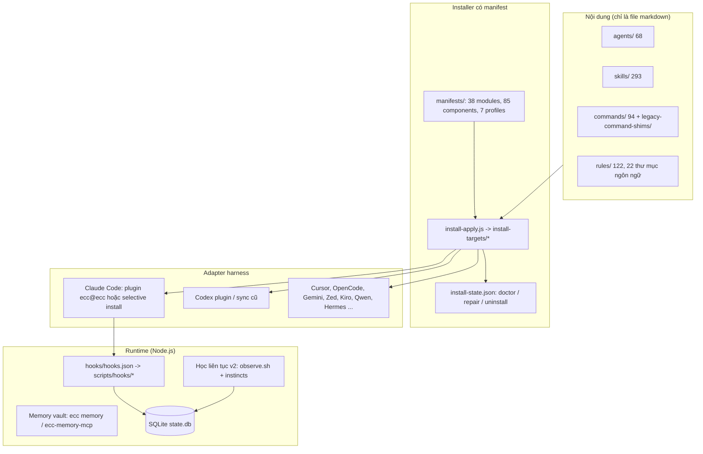

# ECC v2.2.2 — Tính năng và cách sử dụng (đã kiểm chứng trên Windows 11)

Phạm vi: repo `affaan-m/ECC`, commit `c70874fa`, branch `main`, đọc và chạy thử ngày 2026-10-01.
Máy thử: Windows 11 native, PowerShell 7.6, Node 24.14.1, npm 11.12.1, Git 2.50, Claude Code 2.1.96, Codex CLI 0.137.0. WSL có nhưng distro mặc định là `docker-desktop` (không có `/bin/bash`).

Nhãn bằng chứng dùng xuyên suốt:
- **[ĐÃ CHẠY]**: tôi đã chạy lệnh và thấy output thật.
- **[ĐÃ ĐỌC CODE]**: tôi đã đọc mã nguồn nhưng chưa chạy.
- **[SUY LUẬN]**: kết luận từ các dữ kiện trên, có nêu lý do.

Mọi lần cài đặt thử đều nằm trong `Z:\Coding\Projects\AI-Harness\ECC-Sandbox` (target `claude-project`, profile `minimal`, `--no-hooks`). Các lệnh còn lại chạy với `HOME`/`USERPROFILE` giả (`ECC-Sandbox-home`). Không cài plugin, không bật hook toàn cục, không đặt git config toàn cục.

---

## 1. Tóm tắt điều hành

ECC là một **bộ công cụ cấu hình cho coding agent**: 68 agents, 293 skills, 94 command, 122 file rules, một hệ thống hook, một "memory vault", một installer có manifest, và các adapter cho nhiều harness (Claude Code là chính). Số liệu khớp README (đếm lại từ repo: 68 / 293 / 94). Nó không phải thư viện chạy trong ứng dụng của bạn.

Nên dùng nếu: bạn muốn quy trình có kỷ luật (plan → TDD → review → verify), dùng Claude Code hằng ngày, chấp nhận thêm cấu hình, và sẵn sàng tinh chỉnh hook.
Không nên cài nguyên bộ nếu: bạn cần ngữ cảnh gọn, đang dùng sẵn nhiều hook/plugin khác (ví dụ Vercel plugin), hoặc chạy Windows native và cần tính năng học liên tục (observer) hay các script shell.

Kết luận thực tế cho máy này: cài **project-local, `minimal`, `--no-hooks`**; thêm từng hook sau khi đã đo.

---

## 2. Kiến trúc tổng thể



Thành phần phụ: `ecc2/` (Rust, alpha: TUI + SQLite session store, README tự nhận "not the finished product"), `src/llm/` (Python), `ecc_dashboard.py`, `scripts/control-pane.js` (dashboard web cục bộ), `scripts/plan-canvas.js` (duyệt plan trên trình duyệt), `scripts/claw.js` (NanoClaw REPL). [ĐÃ ĐỌC CODE]

Bản thân CLI là `scripts/ecc.js` (bin: `ecc`, `ecc-universal`, `ecc-install`, ...). Lệnh con: `setup, install, plan, catalog, consult, profile, memory, list-installed, doctor, repair, uninstall, auto-update, status, sessions, work-items, session-inspect, loop-status, security-ioc-scan, platform-audit, control-pane, ito, nasiko, feedback, welcome`. [ĐÃ CHẠY `ecc --help`]

---

## 3. Danh mục tính năng

### 3.1 Agents (68)

| Nhóm | Agents (ví dụ) | Ghi chú |
|---|---|---|
| Lập kế hoạch/kiến trúc | planner (opus), architect (opus), code-architect, code-explorer, spec-miner (opus) | planner/architect dùng model opus |
| Chất lượng | code-reviewer, code-simplifier, security-reviewer, silent-failure-hunter, comment-analyzer, pr-test-analyzer, type-design-analyzer, refactor-cleaner, tdd-guide, e2e-runner | |
| Review theo ngôn ngữ | typescript, python, go, rust, java, kotlin, cpp, csharp, fsharp, swift, php, django, fastapi, react, vue, flutter, database, mle, rag-pipeline | `*-reviewer` |
| Sửa build | build-error-resolver, go/rust/java/kotlin/cpp/swift/dart/django/react/pytorch `-build-resolver`, harmonyos-app-resolver | |
| Vận hành/điều phối | loop-operator, harness-optimizer, agent-evaluator, conversation-analyzer, chief-of-staff | |
| GAN harness | gan-planner, gan-generator, gan-evaluator | vòng generator/evaluator |
| Ngoài lập trình | marketing-agent, seo-specialist, healthcare-reviewer (opus), network-*, homelab-architect, opensource-forker/packager/sanitizer, doc-updater, docs-lookup | |

Nguồn: `agents/*.md` (trích frontmatter). [ĐÃ CHẠY]

### 3.2 Commands (94)

Với plugin, tên có tiền tố `/ecc:...`; với cài thủ công có dạng ngắn (`/plan`). Một số lệnh cũ (`/tdd`, `/verify`, `/eval`, `/orchestrate`, `/e2e`, `/docs`, `/prompt-optimize`, `/context-budget`, `/rules-distill`, `/agent-sort`, `/claw`, `/devfleet`) đã chuyển sang `legacy-command-shims/commands/`, chỉ dùng khi chủ động chép. [ĐÃ ĐỌC CODE]

| Nhóm | Lệnh |
|---|---|
| Lập kế hoạch | `plan`, `plan-prd`, `prp-prd`, `prp-plan`, `prp-implement`, `feature-dev`, `plan-canvas` |
| Điều phối theo quy trình | `orch-add-feature`, `orch-fix-defect`, `orch-change-feature`, `orch-refine-code`, `orch-build-mvp`, `orch-review` |
| Review | `code-review`, `review-pr`, `<lang>-review` (go, python, rust, kotlin, cpp, react, vue, fastapi, flutter), `santa-loop` |
| Build/test | `build-fix`, `<lang>-build`, `<lang>-test`, `test-coverage`, `quality-gate`, `gradle-build` |
| Dọn/ghi tài liệu | `refactor-clean`, `update-docs`, `update-codemaps` |
| Git/PR | `prp-commit`, `pr`, `prp-pr` |
| Phiên và bộ nhớ | `save-session`, `resume-session`, `sessions`, `checkpoint`, `aside` |
| Học liên tục | `learn`, `learn-eval`, `instinct-status`, `instinct-import`, `instinct-export`, `evolve`, `promote`, `prune`, `projects`, `skill-create`, `skill-health` |
| Hook/bảo mật | `hookify`, `hookify-list`, `hookify-configure`, `hookify-help`, `security-scan` |
| Vòng lặp tự động | `loop-start`, `loop-status`, `gan-build`, `gan-design` |
| Đa model | `multi-plan`, `multi-execute`, `multi-backend`, `multi-frontend`, `multi-workflow` — cần cài thêm `ccg-workflow` (README) |
| Epic/GitHub | `epic-claim`, `epic-decompose`, `epic-sync`, `epic-validate`, `epic-review`, `epic-publish`, `epic-unblock`, `jira` |
| Khác | `ecc-guide`, `model-route`, `cost-report`, `harness-audit`, `setup-pm`, `pm2`, `project-init`, `auto-update`, `marketing-campaign` |

Chú ý: skill `plan-orchestrate` phát ra lệnh `/orchestrate custom ...`, nhưng `/orchestrate` hiện chỉ có trong `legacy-command-shims`. Nếu không chép shim này thì lệnh phát ra không dùng được. [SUY LUẬN từ `skills/plan-orchestrate/SKILL.md` và danh sách thư mục]

### 3.3 Skills (293) — nhóm theo chủ đề

| Chủ đề | Ví dụ skill |
|---|---|
| Quy trình lõi | `tdd-workflow`, `verification-loop`, `search-first`, `strategic-compact`, `context-budget`, `coding-standards`, `git-workflow`, `architecture-decision-records`, `intent-driven-development` |
| Cổng chất lượng/an toàn | `gateguard`, `safety-guard`, `delivery-gate`, `santa-method`, `council`, `security-review`, `security-scan`, `production-audit` |
| Điều phối agent | `orch-*` (6), `plan-orchestrate`, `ralphinho-rfc-pipeline`, `team-agent-orchestration`, `dmux-workflows`, `claude-devfleet`, `autonomous-loops`, `continuous-agent-loop`, `gan-style-harness`, `parallel-execution-optimizer` |
| Bộ nhớ/học | `continuous-learning-v2` (v1 đã deprecated), `unified-memory`, `ck`, `growth-log`, `rules-distill`, `skill-stocktake`, `skill-comply`, `config-gc` |
| Ngôn ngữ/framework | python, golang, rust, kotlin, swift, java, springboot, quarkus, django, fastapi, laravel, rails, nestjs, nextjs-turbopack, react, vue, nuxt4, angular, react-native, flutter, perl, cpp, csharp, fsharp |
| Dữ liệu/hạ tầng | postgres, mysql, redis, clickhouse, prisma, jpa, database-migrations, docker, kubernetes, deployment-patterns, bun-runtime, vite |
| Kiểm thử/QA | `e2e-testing`, `browser-qa`, `*-testing`, `accessibility`, `benchmark`, `canary-watch`, `click-path-audit`, `windows-desktop-e2e` |
| Nghiên cứu/nội dung | `deep-research`, `exa-search`, `market-research`, `article-writing`, `content-engine`, `seo`, `frontend-slides`, `video-editing`, `manim-video`, `remotion-video-creation`, `fal-ai-media` |
| Vận hành kết nối | `github-ops`, `jira-integration`, `google-workspace-ops`, `email-ops`, `messages-ops`, `unified-notifications-ops`, `customer-billing-ops` |
| Lĩnh vực chuyên biệt | healthcare (EMR/CDSS/HIPAA), logistics/chuỗi cung ứng, mạng (Cisco/BGP/Netmiko), homelab, DeFi/EVM, scientific (PubMed, USPTO, gget), investor-*, ito-* (GPU compute), prediction-market |

Hơn một nửa số skill là chuyên ngành mà đa số dự án không dùng. Đó là lý do có profile và `agent-sort`. [SUY LUẬN từ danh sách trên]

### 3.4 Các cơ chế đáng giá nhất (đã đọc kỹ)

1. **GateGuard** (`gateguard-fact-force.js`, 1809 dòng). Lần Edit/Write đầu tiên vào một file bị **từ chối** cho tới khi agent nêu: ai import file, hàm công khai bị ảnh hưởng, schema dữ liệu, trích nguyên văn yêu cầu của bạn. Gửi lại cùng lời gọi thì được qua. Lệnh Bash phá hủy (`rm -rf`...) cũng bị chặn tương tự, đòi rollback plan. [ĐÃ CHẠY, xem mục 6]
2. **Config protection**: chặn sửa file cấu hình linter/formatter đã tồn tại, để agent sửa code thay vì nới lỏng cấu hình. [ĐÃ CHẠY]
3. **Memory vault** (`ecc memory`): file markdown `ecc.memory.v1` để chuyển ngữ cảnh giữa các harness. Mặc định ở `<repo>/.ecc/memory/project` (kèm `.gitignore` chặn commit). [ĐÃ CHẠY]
4. **Continuous learning v2**: ghi quan sát tool use, tạo "instinct" có điểm tin cậy 0.3–0.9, gom thành skill bằng `/evolve`. Observer nền **tắt mặc định** (`config.json: observer.enabled=false`). [ĐÃ ĐỌC CODE]
5. **Orchestrator `orch-*`**: pipeline Research → Plan → TDD → Review → Commit, có phân loại kích cỡ (trivial/small/standard/large) và 2 cổng người duyệt (duyệt plan, xác nhận commit). [ĐÃ ĐỌC CODE `skills/orch-pipeline`]
6. **Santa method / council**: xác minh đối kháng bằng hai reviewer độc lập; hội đồng 4 góc nhìn cho quyết định mơ hồ. [ĐÃ ĐỌC CODE]
7. **Selective installer**: manifest → plan → copy → ghi `install-state.json` → `doctor/repair/uninstall`. [ĐÃ CHẠY]
8. **Plan Canvas**: server cục bộ để bạn chú thích và duyệt plan trên trình duyệt. [ĐÃ ĐỌC CODE; CHƯA KIỂM CHỨNG]

---

## 4. Cài đặt (Windows)

Chỉ chọn **một** đường cho mỗi harness. Không chồng plugin lên cài thủ công (README: "Do not stack install methods").

### 4.1 Chuẩn bị

```powershell
git clone https://github.com/affaan-m/ECC.git
cd ECC
npm install --ignore-scripts --no-audit --no-fund
```
[ĐÃ CHẠY] 212 gói, 9 giây. Lưu ý: npm làm đổi `yarn.lock` (repo dùng yarn). Hoàn tác bằng `git checkout -- yarn.lock`.

### 4.2 Chọn profile

Số file là số `operations` của dry-run với `--target claude-project --no-hooks`. [ĐÃ CHẠY]

| Profile | Module | File | Dành cho |
|---|---:|---:|---|
| `minimal` | 6 | 489 | khởi đầu an toàn, không hook |
| `core` | 6 | 489 | như minimal khi có `--no-hooks` (nếu không, thêm hook runtime) |
| `developer` | 9 | 619 | dự án ứng dụng (thêm framework-language, database, orchestration) |
| `security` | 7 | 510 | thêm bộ skill bảo mật |
| `research` | 9 | 528 | nghiên cứu, nội dung |
| `full` | 26 | 978 | tất cả; không khuyên dùng |

Ghi chú: `catalog profiles` báo `minimal` có 5 module nhưng kế hoạch thực tế giải ra 6 (có thêm `skill-unified-memory` do phụ thuộc). [ĐÃ CHẠY]

Xem trước theo nhu cầu:
```powershell
node scripts\ecc.js consult "security reviews" --target claude
node scripts\ecc.js catalog components
node scripts\ecc.js catalog show framework:nextjs
```
[ĐÃ CHẠY]

### 4.3 Cách A — project-local, không hook (khuyên dùng)

Chạy từ thư mục dự án đích:
```powershell
node <đường-dẫn>\ECC\scripts\ecc.js install --dry-run --json --profile minimal --target claude-project --no-hooks
node <đường-dẫn>\ECC\scripts\ecc.js install --profile minimal --target claude-project --no-hooks
node <đường-dẫn>\ECC\scripts\ecc.js doctor --target claude-project
```
[ĐÃ CHẠY, kết quả `Status: OK`]

Kết quả thật trong sandbox: `.claude/` chứa 68 agents, 94 commands, 122 rules, 103 skills, 4 script, `settings.json`, `ecc/install-state.json` (`hookConsent: "declined"`). Chỉ có thao tác `copy-file`, không sửa settings của bạn. Nhưng `settings.json` được tạo mới với nội dung `{"includeCoAuthoredBy": false}`, tức **tắt dòng Co-Authored-By trong commit của dự án đó**. Hãy kiểm tra nếu bạn cần dòng đó. [ĐÃ CHẠY]

Nếu không truyền `--enable-hooks` hoặc `--no-hooks` mà profile có hook, installer in giải thích và **dừng trước khi ghi**. [ĐÃ ĐỌC CODE `hook-consent.js`]

### 4.4 Cách B — plugin Claude Code (`ecc@ecc`)

```powershell
node scripts\ecc.js setup --mode claude-plugin --scope user --hooks standard --dry-run --json   # xem trước
node scripts\ecc.js setup            # trình hướng dẫn tương tác
```
Dry-run trả về `{"action":"would-install","marketplaceAction":"would-add","pluginId":"ecc@ecc","scope":"user"}`. [ĐÃ CHẠY, trong HOME giả]

Tùy chọn `--hooks off|minimal|standard|strict`; `--scope user|project|local`. Hook plugin do Claude Code tự nạp từ `hooks/hooks.json` (v2.1+), và README cảnh báo không khai báo thêm `hooks` trong `plugin.json` hay sao chép vào `settings.json` (sẽ chạy đôi).

Các chặn an toàn đã thấy: `setup` từ chối khi thư mục có cài đặt ECC thủ công (`MANAGED_INSTALL_OVERLAP`); từ chối marketplace tên `ecc` nếu không phải `affaan-m/ECC`. [ĐÃ CHẠY / ĐÃ ĐỌC CODE]

Plugin không phân phối `rules`; muốn dùng rules thì chép tay (`rules/common` + 1 gói ngôn ngữ) vào `.claude/rules/ecc/`.

### 4.5 Cách C — Codex

Native: `codex plugin marketplace add affaan-m/ECC` rồi `codex plugin add ecc@ecc`. Đường sync cũ `scripts/sync-ecc-to-codex.sh` chỉ để tương thích và có thể đặt `git config --global core.hooksPath`. [ĐÃ ĐỌC CODE]

**Lỗi đã gặp trên máy này:** `ecc install --guided --harness codex --dry-run` báo "Codex CLI is not installed or `codex` is not on PATH" dù `codex --version` chạy được. Nguyên nhân (đọc code `scripts/lib/codex-plugin-setup.js:162-193`): gọi `execFile('codex')` với `shell: false`, mà trên Windows `codex` là shim npm (`codex.cmd`) nên Node trả ENOENT. Đường guided Codex vì thế không dùng được trên Windows native với bản cài npm này, trừ khi bạn gọi lệnh `codex plugin ...` trực tiếp. [ĐÃ CHẠY + ĐÃ ĐỌC CODE]

### 4.6 Harness khác

`./install.sh --profile minimal --target <cursor|gemini|zed|antigravity|qwen|hermes|openclaw|kimi|codebuddy|joycode>`. Trên Windows dùng `.\install.ps1` (cùng tham số). Trạng thái hỗ trợ (README): Claude Code = stable; Codex = native plugin; Cursor, OpenCode = beta; Copilot = chỉ instruction; các harness còn lại = experimental. [ĐÃ ĐỌC README]

### 4.7 Gỡ cài đặt và sửa lỗi

```powershell
node scripts\ecc.js list-installed
node scripts\ecc.js doctor --target claude-project
node scripts\ecc.js repair --dry-run --target claude-project
node scripts\ecc.js uninstall --dry-run --target claude-project
```
Thử nghiệm: xóa `agents/planner.md` → `doctor` báo `ERROR missing-managed-files: 1` → `repair` khôi phục → `doctor` OK; `uninstall --dry-run` báo sẽ gỡ 490 file. ECC chỉ gỡ file đã ghi trong install-state. [ĐÃ CHẠY]

---

## 5. Cách dùng theo tình huống

Skills là bề mặt chính; command là lối tắt. Với plugin dùng `/ecc:plan`, cài thủ công dùng `/plan`.

| Tình huống | Làm gì | Agent/skill dùng |
|---|---|---|
| Bắt đầu tính năng mới | `/plan "mô tả"` → duyệt → `tdd-workflow` → `/code-review` | planner → tdd-guide → code-reviewer |
| Làm trọn gói có cổng duyệt | `orch-add-feature` (phân loại kích cỡ, duyệt plan, TDD, review, xác nhận commit) | planner, tdd-guide, code-reviewer |
| Sửa bug | viết test tái hiện lỗi (RED) → sửa → xanh → review; hoặc `orch-fix-defect` | tdd-guide |
| Build hỏng | `/build-fix` hoặc `/<lang>-build` | build-error-resolver / resolver theo ngôn ngữ |
| Review PR | `/review-pr` hoặc `/code-review <số PR>` | code-reviewer, silent-failure-hunter, pr-test-analyzer |
| Trước khi phát hành | `verification-loop` (build, type, lint, test+coverage, quét bí mật, review diff), `/security-scan`, `santa-method` | |
| Dọn code chết | `/refactor-clean` | refactor-cleaner |
| Phiên dài | `/context-budget` (cần shim), `strategic-compact`, `/save-session`, `/resume-session` | |
| Chia sẻ ngữ cảnh giữa harness | `ecc memory save/handoff/search` | unified-memory |
| Quyết định mơ hồ | skill `council` | 4 góc nhìn |
| Chọn gói ECC cho repo cụ thể | skill `agent-sort` (phân loại DAILY/LIBRARY có dẫn chứng từ repo) | |
| Tạo luật chặn từ hội thoại | `/hookify` → file `.claude/hookify.<tên>.local.md` | hookify-rules |

Ví dụ memory đã chạy được:
```powershell
node scripts\ecc.js memory init
"Quyết định: dùng profile minimal --no-hooks." | node scripts\ecc.js memory save --title "ECC sandbox decision" --kind decision --tag ecc --stdin
node scripts\ecc.js memory search "sandbox"
node scripts\ecc.js memory doctor
```
Kết quả: tạo `.ecc/memory/project/` có `.gitignore`, bản ghi `[unreviewed]`, `doctor: PASS`. Bản ghi do tool tạo luôn là ngữ cảnh chưa duyệt, không phải chính sách thực thi. [ĐÃ CHẠY]

Ví dụ `harness-audit` (chấm điểm cấu hình) trên sandbox không hook: **5/39**. [ĐÃ CHẠY] Con số thấp là bình thường khi chưa có plugin/hook/test; đừng coi là điểm chất lượng dự án.

---

## 6. Hệ thống hook

Hook được khai báo ở `hooks/hooks.json` (24 matcher, đã kiểm bằng `validate-hooks`). Trong profile `standard` (mặc định), các hook sau chạy. Cột "Ghi" là nơi hook ghi dữ liệu.

| Sự kiện | ID | Profile | Hành vi | Ghi | Gọi LLM/mạng |
|---|---|---|---|---|---|
| PreToolUse Bash | `pre:bash:dispatcher` gồm `block-no-verify` | minimal+ | chặn `--no-verify`, `-c core.hooksPath=` (exit 2) | — | không |
| | `auto-tmux-dev` | mặc định | chặn dev server ngoài tmux | — | không |
| | `gateguard-fact-force` (Bash) | standard+ | từ chối lệnh phá hủy cho tới khi nêu danh sách/rollback | `~/.gateguard/state-<phiên>.json` | không |
| | `tmux-reminder`, `git-push-reminder`, `commit-quality` | **strict** | nhắc nhở; commit-quality chặn lỗi nặng | — | không |
| PreToolUse PowerShell | `gateguard-fact-force` | standard+ | như trên | như trên | không |
| PreToolUse Write | `doc-file-warning` | standard+ | cảnh báo tên như NOTES.md ngoài thư mục có cấu trúc (không chặn) | — | không |
| PreToolUse Edit/Write | `suggest-compact` | standard+ | gợi ý `/compact` theo kích cỡ ngữ cảnh/số lần gọi | file trạng thái tạm | không |
| | `gateguard-fact-force` (Edit/Write) | standard+ | từ chối lần sửa đầu mỗi file | như trên | không |
| PreToolUse Write/Edit/MultiEdit | `config-protection` | standard+ | chặn sửa file cấu hình linter/formatter đã có (exit 2) | — | không |
| PreToolUse mọi tool | `observe` (async, 10s) | standard+ | chạy `observe.sh` qua bash để ghi quan sát | thư mục `ecc-homunculus` | không |
| PreToolUse mọi tool (Bash/Write/Edit) | `governance-capture` | standard+ nhưng chỉ làm việc khi `ECC_GOVERNANCE_CAPTURE=1` | phát hiện bí mật, lệnh cần duyệt | state store | không |
| PreToolUse `mcp__*` | `mcp-health-check` | standard+ | dò sức khỏe MCP, có thể kết nối lại/dừng tiến trình MCP | file trạng thái | **dò endpoint MCP** |
| PreCompact | `pre:compact` | standard+ | lưu tóm tắt trước khi nén | file phiên | **`claude -p` (haiku)** |
| SessionStart | `session-start-bootstrap`, `plan-canvas-sessions` | — / standard+ | nạp ngữ cảnh phiên trước + instinct (mặc định tối đa 8000 ký tự, 6 instinct) | dọn phiên cũ >30 ngày | không |
| PostToolUse (đồng bộ) | dispatcher: `design-quality-check`, `post-edit-accumulator`, `console-warn`, `governance-capture`, `session-activity-tracker`, `ecc-metrics-bridge` (cả minimal), `ecc-context-monitor` | standard+ | nhắc về UI chung chung, gom file đã sửa, đếm tool, cảnh báo ngữ cảnh/chi phí/vòng lặp | `~/.claude/metrics/tool-usage.jsonl`, `/tmp/ecc-metrics-*.json` | không |
| PostToolUse (async) | dispatcher: bash `command-log-audit`, `command-log-cost`, `pr-created`, `build-complete`, `quality-gate`, `observe`, `skill:track` | standard+ | xem ghi chú dưới | `~/.claude/bash-commands.log`, `cost-tracker.log`, `state/skill-runs.jsonl` | không |
| PostToolUseFailure | `post:mcp-health-check`, `post:skill:track` | standard+ | đánh dấu MCP lỗi; ghi lần chạy skill | | |
| Stop | `plan-canvas-pending` | minimal+ | chặn dừng để chuyển phản hồi canvas chưa giao | | cục bộ |
| | `stop-format-typecheck` (timeout 300s) | standard+ | **chạy formatter (prettier/biome) và `tsc --noEmit` trên các file JS/TS vừa sửa** | **sửa file nguồn** | không |
| | `check-console-log` | standard+ | kiểm `console.log` trong file đã sửa | | |
| | `session-end` (async) | **minimal+** | cập nhật tóm tắt phiên; **gọi `claude --model haiku -p`** khi ngữ cảnh còn <20% hoặc mỗi 50 tin nhắn | `~/.claude/session-data/` | **có (đến 7000 ký tự transcript)** |
| | `evaluate-session` (async) | minimal+ | trích mẫu học được | `~/.claude/skills/learned/` | không |
| | `cost-tracker` (async) | minimal+ | cộng usage từ transcript | `~/.claude/metrics/costs.jsonl` | không |
| | `desktop-notify` | standard+ | thông báo desktop (macOS; WSL cần BurntToast) | | PowerShell/osascript |
| SessionEnd | `session-end-marker` | minimal+ | dấu mốc vòng đời | | |

Ghi chú quan trọng (nguồn: `hooks.json`, `bash-hook-dispatcher.js`, `hook-flags.js`, `session-end.js:250-260`, `llm-summary.js`):
- Khi hook không khai báo profile, mặc định là `standard,strict`. Vì vậy `command-log-audit` và `command-log-cost` **có chạy** ở `standard`; chúng ghi lệnh Bash vào `~/.claude/bash-commands.log` sau khi che token, `Authorization`, khóa AWS, `ghp_`, password. Bí mật có dạng khác vẫn có thể lọt vào log. [ĐÃ ĐỌC CODE]
- `session-end` hoạt động ngay cả ở `minimal`, nên `minimal` **vẫn có thể phát sinh lệnh gọi `claude -p`** (tốn token, gửi nội dung phiên tới API qua chính Claude Code của bạn). Tắt bằng `ECC_SKIP_LLM_SUMMARY=1`. [ĐÃ ĐỌC CODE]
- `stop-format-typecheck` là hook duy nhất tự **sửa source** (qua formatter) mà không hỏi. Gọi qua `spawnSync(... shell: true)`. [ĐÃ ĐỌC CODE]
- `hook-consent.js` tự liệt kê 6 nhóm năng lực: tự ghi source, viết lại lệnh/điều khiển tiến trình, gửi văn bản transcript tới LLM ngoài, hoạt động MCP, cổng cho phép/từ chối, lưu bản ghi phiên/chi phí. Đây là mô tả đúng bản chất. [ĐÃ ĐỌC CODE]

### 6.1 Hook đã chạy thử trực tiếp (stdin giả, HOME giả)

| Thử | Kết quả |
|---|---|
| Edit file `.eslintrc.json` đã tồn tại (không đổi nội dung) | `exit=2`: "BLOCKED: Modifying .eslintrc.json is not allowed…" — **chặn cả sửa vô hại**. |
| Edit `src1.js` lần 1 (GateGuard) | `permissionDecision: deny` + yêu cầu 4 sự kiện. |
| Gửi lại đúng lời gọi | Cho qua (trả nguyên input). |
| `git commit --no-verify` | `exit=2`: "BLOCKED: --no-verify flag is not allowed". |
| `rm -rf build` | deny với "Destructive command detected", đòi liệt kê file và rollback. |
| Write `NOTES.md` | Cảnh báo "Ad-hoc documentation filename", không chặn. |
| `ECC_HOOK_PROFILE=minimal` hoặc `ECC_DISABLED_HOOKS=<id>` | Hook im lặng (không chặn). |
| `observe` trên máy này | In "shell runtime unavailable; skipping continuous-learning observation", `exit=0`. |

Giải thích dòng cuối: `bash` trên PATH của máy là launcher WSL (distro docker-desktop không có `/bin/bash`); `observe-runner.js:47-73` thử `$BASH`, `bash.exe`, `bash`, `sh` và bỏ qua nếu lệnh thử không thoát 0. Git Bash có cài (`C:\Program Files\Git\bin\bash.exe`) nhưng không được tìm thấy. Đặt biến môi trường `BASH` trỏ tới nó có thể bật lại hook, nhưng tôi **chưa kiểm chứng** và README ghi observer nền trên Windows native là no-op. [ĐÃ CHẠY + ĐÃ ĐỌC CODE]

---

## 7. Cấu hình và biến môi trường

| Biến | Mặc định | Tác dụng |
|---|---|---|
| `ECC_HOOKS_ENABLED` | true | công tắc tổng cho mọi hook ECC |
| `ECC_HOOK_PROFILE` | `standard` | `minimal` / `standard` / `strict`; giá trị lạ → `standard` |
| `ECC_DISABLED_HOOKS` | rỗng | danh sách ID hook tắt, phân cách bằng dấu phẩy |
| `ECC_HOOK_INPUT_MAX_BYTES` | 1048576 | trần kích thước stdin của hook |
| `ECC_GATEGUARD=off` / `GATEGUARD_DISABLED=1` | bật | tắt GateGuard |
| `GATEGUARD_EXEMPT_GLOBS` | rỗng | glob file bỏ qua cổng edit đầu tiên (nên đặt cho tests/dist/docs) |
| `GATEGUARD_BASH_ROUTINE_DISABLED` | bật | tắt cổng cho Bash thường (giữ cổng lệnh phá hủy) |
| `GATEGUARD_FACT_FORCE_FULL_DENIALS` | 3 | số lần từ chối hiện đủ 4 sự kiện |
| `GATEGUARD_BASH_EXTRA_DESTRUCTIVE` | rỗng | regex lệnh phá hủy bổ sung |
| `GATEGUARD_STATE_DIR` | `~/.gateguard` | nơi lưu trạng thái cổng |
| `ECC_SESSION_START_CONTEXT=off` | bật | tắt ngữ cảnh chèn lúc bắt đầu phiên |
| `ECC_SESSION_START_MAX_CHARS` | 8000 | trần ký tự ngữ cảnh đó |
| `ECC_SESSION_RETENTION_DAYS` | 30 | số ngày giữ phiên (0/off = giữ hết) |
| `ECC_MAX_INJECTED_INSTINCTS` / `ECC_INSTINCT_CONFIDENCE_THRESHOLD` | 6 / 0.7 | giới hạn instinct chèn vào |
| `ECC_INSTINCT_RELEVANCE_RANKING` | on | xếp hạng theo stack |
| `ECC_CONTEXT_MONITOR_COST_WARNINGS` | on | `off` nếu dùng gói thuê bao |
| `ECC_SKIP_LLM_SUMMARY` | không | `1` tắt lệnh gọi `claude -p` tóm tắt |
| `ECC_LLM_SUMMARY_MODEL` | `haiku` | model dùng để tóm tắt |
| `ECC_LLM_SUMMARY_CONTEXT_THRESHOLD` / `ECC_LLM_SUMMARY_INTERVAL` | 20 / 50 | ngưỡng kích hoạt tóm tắt |
| `ECC_GOVERNANCE_CAPTURE` | không | `1` mới bật governance-capture |
| `ECC_SKIP_OBSERVE` / `ECC_OBSERVE_SKIP_PATHS` | 0 / `observer-sessions,.claude-mem` | bỏ qua quan sát |
| `ECC_OBSERVE_RUNNER_TIMEOUT_MS` | 9000 | timeout observe |
| `ECC_AGENT_DATA_HOME` | `~/.claude` | gốc dữ liệu phiên/metrics/learned |
| `CLV2_HOMUNCULUS_DIR` | `~/.local/share/ecc-homunculus` | dữ liệu học liên tục |
| `COMPACT_THRESHOLD`, `COMPACT_CONTEXT_THRESHOLD`, `COMPACT_CONTEXT_INTERVAL`, `ECC_CONTEXT_WINDOW_TOKENS` | 50 / 160k (200k window) / 60k / tự phát hiện | gợi ý `/compact` |
| `ECC_DISABLED_MCPS` | rỗng | lọc MCP khi install/sync (không phải công tắc runtime) |
| `ECC_DRY_RUN` | — | `1` (hoặc `--dry-run`) chỉ xem trước |
| `ECC_MEMORY_PROJECT_ROOT`, `ECC_MEMORY_USER_ROOT`, `ECC_MEMORY_HARNESS` | thư mục hiện tại / `~/.ecc/memory` | vault |
| `ECC_PLAN_CANVAS_PORT`, `ECC_PLAN_CANVAS_STATE_DIR`, `ECC_PLAN_CANVAS_IDLE_MS`, `ECC_PLAN_CANVAS_STOP_SCOPE` | — | Plan Canvas |
| `CLAUDE_PACKAGE_MANAGER` | tự dò | npm/pnpm/yarn/bun |

Nguồn: README, `hooks/README.md`, `skills/gateguard/SKILL.md`, `scripts/lib/hook-flags.js`, `llm-summary.js`. [ĐÃ ĐỌC CODE]

Gợi ý cho `settings.json` từ README (giảm token): `model: sonnet`, `MAX_THINKING_TOKENS=10000`, `CLAUDE_AUTOCOMPACT_PCT_OVERRIDE=50`, `CLAUDE_CODE_SUBAGENT_MODEL=haiku`. Các số "tiết kiệm ~60%/~70%" là của tác giả, tôi chưa đo.

---

## 8. Dữ liệu ECC ghi ra máy

| Vị trí | Nội dung | Ai ghi | Xác minh |
|---|---|---|---|
| `<dự án>/.claude/ecc/install-state.json` | bản ghi cài đặt, hash file | installer | ĐÃ CHẠY |
| **`$HOME\.claude\ecc\state.db`** | bản chiếu SQLite của install-state | **mọi** `install/repair/uninstall`, **kể cả target project** | ĐÃ CHẠY |
| `~/.claude/session-data/` | tóm tắt phiên | `session-end` | ĐÃ ĐỌC CODE |
| `~/.claude/metrics/costs.jsonl`, `tool-usage.jsonl` | chi phí, hoạt động | `cost-tracker`, `session-activity-tracker` | ĐÃ ĐỌC CODE |
| `~/.claude/bash-commands.log`, `cost-tracker.log` | lệnh Bash đã che bí mật | `command-log-*` | ĐÃ ĐỌC CODE |
| `~/.claude/skills/learned/`, `state/skill-runs.jsonl` | skill học được, lần chạy skill | `evaluate-session`, `skill-run-tracker` | ĐÃ ĐỌC CODE |
| `~/.gateguard/state-<phiên>.json` | trạng thái cổng | GateGuard | ĐÃ CHẠY |
| `~/.local/share/ecc-homunculus/` | quan sát, instinct | `observe.sh` (cần bash) | ĐÃ ĐỌC CODE |
| `/tmp/ecc-metrics-<phiên>.json` | tổng hợp phiên cho statusline | `ecc-metrics-bridge` | ĐÃ ĐỌC CODE |
| `<repo>/.ecc/memory/`, `~/.ecc/memory/` | vault | `ecc memory` | ĐÃ CHẠY (project) |

**Tác dụng phụ đã ghi nhận:** lần cài đầu tiên của tôi đã tạo `C:\Users\Kieu Oanh\.claude\ecc\state.db` (356 KB) ở HOME thật dù chỉ cài vào sandbox. Mã: `scripts/install-apply.js:194` gọi `projectCanonicalInstallState`, và `state-store/index.js:192-193` chọn `process.env.HOME || os.homedir()`. Tôi đã **di chuyển** file đó sang `ECC-Sandbox-evidence\state.db.from-real-home` và xóa thư mục rỗng; mọi lệnh sau chạy với HOME giả. Biến `HOME` được ưu tiên hơn `USERPROFILE`, nên đặt `HOME` là cách cô lập (đã chứng minh). Đây là bản chiếu dẫn xuất (cache), không ảnh hưởng `install-state.json`. [ĐÃ CHẠY]

Ngoài file trên, so sánh `~/.claude` trước/sau chỉ thấy các file do chính Claude Code tạo (`sessions/`, `backups/`); không có file nào của ECC khác. [ĐÃ CHẠY] Không có `core.hooksPath` toàn cục. [ĐÃ CHẠY]

Xóa sạch: gỡ `.claude/` trong dự án (hoặc `uninstall`), xóa `~/.claude/ecc/`, `~/.gateguard/`, `~/.claude/{session-data,metrics}` nếu có, `~/.local/share/ecc-homunculus/`, `.ecc/` trong repo.

---

## 9. Bảo mật và rủi ro

| Nhóm | Mức | Căn cứ |
|---|---|---|
| Installer (copy vào `.claude/`) | THẤP–TRUNG | chỉ `copy-file`, có `--dry-run`, có `doctor/repair/uninstall`, `--ignore-scripts` khi `npm install`; nhưng ghi `state.db` vào HOME |
| Hook runtime | **CAO** | chạy ở mọi tool call, có thể chặn/đổi hành vi, tự sửa source (format), spawn tiến trình |
| Lệnh gọi LLM ngoài | TRUNG | `session-end` và `pre-compact` gọi `claude -p` (kể cả `minimal` cho `session-end`) |
| Ghi dữ liệu bền vững | TRUNG | log lệnh Bash, transcript tóm tắt, chi phí; regex che bí mật không đầy đủ |
| Git toàn cục | CAO nếu dùng đường Codex sync | `install-global-git-hooks.sh`, `codex-legacy-sync.js` đặt `core.hooksPath` toàn cục (có kiểm tra giá trị cũ) |
| MCP | TRUNG | `.mcp.json` có 1 server mặc định (`chrome-devtools-mcp@1.10.1` qua `npx -y`); `mcp-configs/` liệt kê 34 server mẫu, không tự bật. Chính sách trong `docs/MCP-CONNECTOR-POLICY.md` |
| Tiến trình nền | THẤP–TRUNG | observer tắt mặc định; `plan-canvas`, `control-pane`, `dashboard-web` mở server cục bộ (có `loopback-guard.js`) |
| Chuỗi cung ứng | TRUNG | `auto-update.js` kéo mã mới và cài lại; plugin hook tự dò thư mục gốc ECC bằng đoạn `node -e` dài trong `hooks.json`; có `security-ioc-scan` trong CI |

Giảm thiểu: dùng `--no-hooks`; ghim commit/tag; không bật `auto-update`; đặt `ECC_SKIP_LLM_SUMMARY=1`; đặt `ECC_HOOK_PROFILE=minimal`; chạy `ecc security-ioc-scan --home` định kỳ (chưa chạy); cân nhắc đặt `HOME` riêng khi thử.

---

## 10. So sánh với Claude Code thuần, và va chạm với cấu hình hiện có

Lợi: quy trình nhất quán, cổng chặn hành vi xấu (GateGuard, config-protection, no-verify), review chuyên theo ngôn ngữ, bộ nhớ chia sẻ, kiểm kê cấu hình.
Hại: tăng ngữ cảnh và độ trễ, nhiều thứ tự động khó dự đoán, phụ thuộc bash/Python cho một số tính năng, tài liệu dài.

**Chi phí ngữ cảnh (ước lượng):**
- Siêu dữ liệu `name + description` của 68 agent, 94 command, 293 skill cộng lại ≈ 124 nghìn ký tự ≈ **31 nghìn token** (chia 4; chặn trên, vì tôi chưa đo cách Claude Code thực sự quảng bá). README nói plugin quảng bá toàn bộ catalog cho model. [ƯỚC LƯỢNG]
- Rules: 122 file, ~285 nghìn ký tự, nhưng **111 file có `paths:` (chỉ áp dụng khi mở file khớp)**; 10 file không giới hạn ≈ 6 nghìn token (`rules/common`). [ĐÃ CHẠY đếm; hành vi nạp theo `paths:` là SUY LUẬN]
- Cài thủ công `minimal` chép 103 skill vào `.claude/skills/`, ít hơn nhiều so với plugin. [ĐÃ CHẠY]

**Va chạm với môi trường của bạn** (hook Vercel plugin chạy lúc SessionStart, MCP chrome-devtools/playwright/lighthouse): nhiều hook cùng matcher `.*` sẽ chạy song song ở mỗi tool call. Tôi **chưa đo** độ trễ tổng cộng. Cũng lưu ý ECC ship `chrome-devtools` làm connector mặc định, trùng với MCP bạn đã có. [SUY LUẬN]

---

## 11. Xử lý sự cố

| Triệu chứng | Nguyên nhân | Xử lý |
|---|---|---|
| ECC xuất hiện hai lần/hook chạy đôi | chồng plugin lên cài thủ công | gỡ plugin → `ecc uninstall --dry-run` → cài lại một đường |
| `MANAGED_INSTALL_OVERLAP` | có install-state thủ công khi chạy `setup` | gỡ cài thủ công trước |
| `Duplicate hooks file detected` | khai báo `hooks` trong `plugin.json` | không khai báo (Claude Code tự nạp) |
| `ecc doctor` báo `missing-managed-files` | file bị xóa | `ecc repair` |
| `guided --harness codex` báo không tìm thấy `codex` (Windows) | `execFile` không gọi được shim `.cmd` | dùng lệnh `codex plugin ...` trực tiếp; báo lỗi cho upstream |
| "shell runtime unavailable; skipping continuous-learning" | `bash` là launcher WSL hỏng | đặt `BASH` tới Git Bash (chưa kiểm chứng) hoặc chấp nhận tắt observe |
| Edit file cấu hình bị chặn | `config-protection` | `ECC_DISABLED_HOOKS=pre:config-protection` tạm thời |
| Mọi Edit đầu bị từ chối | GateGuard | nêu 4 sự kiện rồi gửi lại, hoặc `GATEGUARD_EXEMPT_GLOBS`, hoặc `ECC_GATEGUARD=off` |
| `npm install` làm đổi `yarn.lock` | repo dùng yarn | `git checkout -- yarn.lock` |
| Cần báo lỗi | — | `ecc feedback` (không tự upload chẩn đoán) |

---

## 12. Khuyến nghị cho người dùng này

Lộ trình theo mức độ rủi ro tăng dần:

1. **Bước 0 (đang có):** sandbox `ECC-Sandbox` đã cài `minimal --no-hooks`; có thể dùng để thử skill/command bằng cách mở Claude Code trong thư mục đó.
2. **Bước 1:** dùng `claude-project` + `minimal` + `--no-hooks` cho một dự án thật. Đặt `HOME` riêng khi cài nếu muốn tránh `state.db` ở HOME thật. Kiểm tra `.claude/settings.json` có `includeCoAuthoredBy:false` ảnh hưởng quy ước commit của bạn.
3. **Bước 2:** nếu muốn gateguard/config-protection, thêm hook runtime ở **profile `minimal`**, đặt `ECC_SKIP_LLM_SUMMARY=1`, `GATEGUARD_EXEMPT_GLOBS`, và đo độ trễ cạnh hook Vercel.
4. **Bước 3 (tùy chọn):** plugin `ecc@ecc` với `--hooks off` để chỉ lấy skill/agent/command, sau đó bật dần.
5. **Tránh:** `--profile full`, `auto-update`, đường Codex sync cũ, `multi-*` khi chưa cài `ccg-workflow`.
6. Nếu chỉ cần nội dung, tự chọn lọc một vài agent/skill/rule (ECC-Lite): `ecc install --skills tdd-workflow,security-review --target claude-project --no-hooks`. (Cờ `--skills` có trong help; **chưa chạy thử**.)

---

## 13. Phụ lục

### 13.1 Giới hạn và điều chưa kiểm chứng
- **`npm test` của ECC chưa chạy xong.** Phiên làm việc bị ngắt giữa chừng (dừng ở `lib/claude-plugin-setup.test.js`; đã bắt đầu 253 suite). Trong phần đã chạy: các bước validator đều qua (68 agent, 94 command, 122 rule, 811 thư mục skill gồm cả bản trong adapter, 24 matcher hook, 38 module/85 component/7 profile), và có **3 suite thất bại trên máy này**: `hooks/continuous-learning-observe-runner.test.js` (1), `hooks/observe-entrypoint-allowlist.test.js` (7), `hooks/plugin-hook-bootstrap.test.js` (1). Cả ba liên quan hook observe/bootstrap; tôi **chưa phân tích nguyên nhân** (nghi do thiếu bash trên Windows, đó là SUY LUẬN). Log: `ECC-Sandbox-evidence\npm-test.log`.
- Chưa chạy: cài plugin thật, cài `--enable-hooks`, Plan Canvas, `control-pane`, `claw`, `auto-update`, `security-ioc-scan`, Codex sync, các adapter Cursor/OpenCode, `ecc2` (Rust), `src/llm`, `ito`/`nasiko`.
- Chưa đọc kỹ: `install-executor.js`, `uninstall.js`, `session-start.js`, `observe.sh`, nội dung từng skill ngoài các skill lõi nêu ở mục 3.4, `.codex/`, `.opencode/`, `.cursor/` (chỉ đọc README).
- Chi phí token là ước lượng; không đo độ trễ hook; không đo hiệu quả (các con số A/B "+2.25 điểm" của GateGuard là của tác giả).
- Tôi đã đính chính hai nhận định trong báo cáo trước: observer nền **tắt mặc định**, và hook **có gọi LLM** (`claude -p`) chứ không "không gọi gì bên ngoài"; log lệnh Bash **có** chạy ở `standard`.

### 13.2 File đã đọc (chính)
`README.md`, `hooks/README.md`, `hooks/hooks.json`, `hooks/hooks.metadata.json`, `package.json`, `install.sh`, `install.ps1`, `AGENTS.md`, `docs/{MIGRATION-1X-TO-2.0,MCP-CONNECTOR-POLICY,SELECTIVE-INSTALL-ARCHITECTURE,ECC-2.0-REFERENCE-ARCHITECTURE}.md`, `scripts/install-apply.js` (một phần), `scripts/lib/{install-state-store-sync,state-store/index,hook-flags,llm-summary,claude-plugin-setup,codex-plugin-setup,install/hook-consent}.js`, `scripts/hooks/{bash-hook-dispatcher,posttooluse-dispatcher,pre-bash-dispatcher,gateguard-fact-force,config-protection,session-end,observe-runner,post-bash-command-log,governance-capture,desktop-notify,...}.js`, `skills/{tdd-workflow,verification-loop,gateguard,strategic-compact,continuous-learning-v2,unified-memory,orch-pipeline,plan-orchestrate,santa-method,council,hookify-rules,configure-ecc,agent-sort,context-budget,ck}/SKILL.md`, `rules/common/*`, `ecc2/README.md`.

### 13.3 Bằng chứng và thư mục liên quan
- Sandbox cài thử: `Z:\Coding\Projects\AI-Harness\ECC-Sandbox`
- HOME giả dùng khi chạy lệnh: `Z:\Coding\Projects\AI-Harness\ECC-Sandbox-home`
- Bằng chứng: `Z:\Coding\Projects\AI-Harness\ECC-Sandbox-evidence` (`npm-test.log`, `state.db.from-real-home`)
- Repo ECC: `Z:\Coding\Projects\AI-Harness\ECC` (sạch, `node_modules` đã cài với `--ignore-scripts`)
