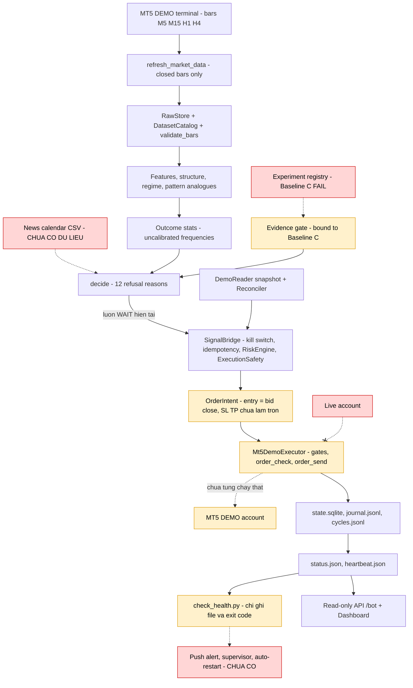
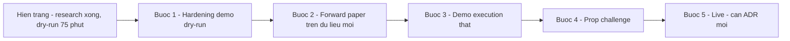

# xau-edge — Báo cáo đánh giá mức sẵn sàng chạy bot thật (Pre-mortem)

> Ngày phân tích: 2026-10-08. Phạm vi: chỉ đọc code/docs, chạy `uv run pytest` (1.233 passed, 0 failed, 0 skipped). Không kết nối MT5/broker.

## 1. TL;DR

`xau-edge` là một **nền tảng nghiên cứu + hỗ trợ quyết định** cho XAUUSD, kèm một nhánh **bot MT5 chỉ-DEMO, mặc định dry-run**, được thiết kế theo nguyên tắc fail-closed. Về kỹ thuật, dự án đã hoàn tất giai đoạn nghiên cứu (L0–L4b) và vừa có bot demo dry-run (mới có bằng chứng vận hành thật 8 chu kỳ M15 ≈ 75 phút ngày 2026-10-08).

**Rào cản lớn nhất không phải code mà là chiến lược: chưa có edge nào được kiểm định** — 3 baseline + 4 model đều FAIL bộ tiêu chí đã đăng ký trước, nên tín hiệu luôn `WAIT`. Kế tiếp: không có lịch tin tức (`NEWS_UNKNOWN` → `WAIT`), đường `order_send` thật chưa từng chạy, và thiếu tầng vận hành 24/5 (supervisor, cảnh báo đẩy). Live bị **cố ý chặn** (ADR-0018/0019), không phải thiếu sót.

## 2. Mục đích & triết lý của tác giả

- **Vấn đề giải quyết**: trả lời "thị trường đang ở regime nào, bias khung lớn ra sao, các cấu trúc tương tự trong lịch sử dẫn tới gì, xác suất/EV sau chi phí bao nhiêu, nên BUY/SELL hay **WAIT**" — *"A high-quality 'no trade' is a valid and valuable output"* (`README.md:6-9`).
- **Thứ tự ưu tiên** (`AGENTS.md` – Mission): *"Protect statistical integrity first, capital second, and automate execution last."*
- **"Chứng minh edge trước khi trade"**: tiêu chí viết **trước** khi có kết quả (`docs/evals/edge-criteria.md:1-5`): chia Dev/Validation/Test theo thời gian, Test bị khóa; 7 tiêu chí (≥100 lệnh, cận dưới bootstrap CI > 0 ở mức `1-0.05/K`, PF ≥ 1.2, DD ≤ 15R, dương 3/4 fold, bỏ 5% lệnh tốt nhất vẫn dương, không regime nào > 60% lợi nhuận); K đếm từ registry (`scripts/run_backtest.py:70`, `evaluation/protocol.py:13-18`).
- **Evidence gate trong code**: chỉ cho BUY/SELL khi cấu hình đã PASS cả dev + validation + test trên cùng dataset, cây git sạch (`src/xau_edge/signals/evidence.py:18, 40-47`); ngược lại `NO_VALIDATED_EDGE` (`signals/decision.py:138-139`).
- **Trung thực với kết quả âm**: *"The research finding is negative… the system's honest output is WAIT"* (`docs/reports/final-status.md:10-13`).
- **Đối tượng**: một chủ dự án cá nhân trên Windows với terminal FTMO demo, hướng tới prop firm (`configs/prop/ftmo_*.yaml`, `configs/brokers/ftmo_demo.yaml`).
- **Lộ trình**: L0→L4b đạt; L4c (forward paper trên dữ liệu mới) chưa chạy; **L5 (tiền thật) nằm ngoài phạm vi theo quyết định** (`final-status.md:34-38`). ADR-0019 chỉ mở nhánh demo để kiểm thử cơ chế vận hành, *"does not authorize live trading"* (`docs/decisions/0019-demo-execution-scope.md:75-78`).
- **Bối cảnh quy trình**: toàn bộ 25 commit được viết trong ~14 giờ ngày 2026-10-08 (06:41 → 20:16) bởi AI agent theo quy trình ECC (`.claude/`). Code rất kỷ luật nhưng **chưa có "thời gian trên thị trường"**.

## 3. Sơ đồ luồng end-to-end (đỏ = đứt, cam = một phần/chỉ test bằng fake)

| Mắt xích | Trạng thái | Bằng chứng |
|---|---|---|
| Data → Signal | Chạy trên dữ liệu thật | `data/execution/cycles.jsonl` (8 dòng, data_age 0,33–8 phút) |
| Signal → Bridge | Bị chặn: mọi chu kỳ `WAIT` | journal: `NO_VALIDATED_EDGE`, `NEWS_UNKNOWN` |
| News | Đứt — không có dữ liệu | `.env` không có `XAU_EDGE_NEWS_CALENDAR_PATH`; `news/calendar.py:1-6` |
| Executor → MT5 | Chỉ test với fake | `docs/reports/demo-bot-status.md:25-29`; không có `MT5_TRADE_PASSWORD` |
| Live | Cố ý chặn | `config.py:49-58`, `brokers/mt5_demo/reader.py:89-91` |
| Giám sát | Chỉ ghi file | `scripts/check_health.py:44-49` |

## 4. Mức độ hoàn thành theo module

| Module | Trạng thái | % | Test | Bằng chứng / nhận xét |
|---|---|---:|---:|---|
| `domain` | Hoàn chỉnh | 95 | 25 | Bar/timeframe/instrument contract; `domain/instrument.py` kiểm point↔digits |
| `market_data` | Hoàn chỉnh (cho nghiên cứu) | 85 | 225 | Broker clock NY+7 đo được (`configs/brokers/ftmo_demo.yaml:5-8`), validator báo lỗi không sửa (ADR-0005). Trừ điểm: mỗi refresh tạo file parquet mới, catalog hash lại toàn bộ (`refresh.py:47-53`, `catalog.py:36-37`) |
| `features` | Hoàn chỉnh | 90 | 170 | So khớp golden với TA-Lib, hash regression |
| `structure` / regime | Hoàn chỉnh | 90 | 42 | Không repaint, test đối xứng gương |
| `patterns` | Hoàn chỉnh | 90 | 46 + 12 statistical | Quy tắc leakage `e <= q - W - H` (ADR-0013) |
| `outcomes` | Hoàn chỉnh | 90 | 22 | MFE/MAE, expected R |
| `strategies` | Hoàn chỉnh, **kết quả FAIL** | 85 | 31 | A/B/C đều FAIL cả hai giai đoạn (`docs/reports/checkpoint-1.md:9-16`) |
| `backtest` | Một phần (có chủ đích) | 80 | 48 | Bid/ask, spread, swap; slippage 3 point là **giả định**, commission 0 **chưa xác minh**, không triple swap/partial fill/latency/margin (ADR-0015) |
| `risk` | Một phần | 70 | 38 | Engine tốt (`risk/engine.py:31-37`) nhưng `check_account` không được gọi trong vòng lặp demo; baseline ngày lấy theo lần thấy đầu |
| `news` | Khung sườn | 30 | 15 | Loader + guard fail-closed; **không có nguồn dữ liệu** |
| `models` (ML) | Hoàn chỉnh (benchmark) | 85 | 58 | Không model nào thắng base rate OOS; tầng signal không dùng |
| `evaluation` / `experiments` | Hoàn chỉnh | 90 | 55 | Bonferroni, bootstrap khối ngày, power test |
| `signals` | Hoàn chỉnh kỹ thuật, edge = 0 | 85 | 69 | Gắn cứng Baseline C (`signals/engine.py:53-57`) |
| `execution` | Gần hoàn chỉnh | 80 | 138 | State SQLite fail-closed, exactly-once, reconcile trước submit |
| `brokers/mt5_demo` | Một phần (chỉ fake) | 60 | 69 | `order_send` thật chưa chạy; lỗi so bid/ask; SL/TP chưa làm tròn |
| `api` | Hoàn chỉnh (read-only) | 85 | 44 | Chỉ GET + `POST /paper/orders` |
| `apps/dashboard` | Hoàn chỉnh (read-only) | 80 | 0 browser test | CI lint/build/tsc |
| Vận hành (daemon/supervision/alert/deploy) | Khung sườn | 35 | — | Chỉ `while True` trong script; không service, không push alert |
| Integration với broker thật | Chưa có | 0 | 0 | Marker `mt5` có nhưng không test nào dùng |

**Tổng quan**: nền tảng nghiên cứu ≈ **90%**; hạ tầng bot demo ≈ **65–70%**; sẵn sàng làm bot tiền thật ≈ **10–15%**.

## 5. Pre-mortem — vì sao bot "chạy tiền thật 24/5 trong 30 ngày" thất bại

Kịch bản: (i) không vào được (live bị chặn), (ii) chạy 30 ngày với 0 lệnh, hoặc (iii) nếu gỡ gate thì trade một chiến lược kỳ vọng âm.

Ký hiệu cột Trạng thái: ✅ đã xử lý trong code (có commit), 🟠 code xong nhưng còn việc của chủ dự án hoặc cần thời gian thực, ❌ chưa xử lý hoặc vẫn là blocker. Tổng hợp: `docs/reports/funded-readiness.md`.

### a) Edge / chiến lược
| # | Mô tả | Bằng chứng | Mức chặn | Công sức | Trạng thái (2026-10-08) |
|---|---|---|---|---|---|
| a1 | Chưa có edge được kiểm định; kết quả đổi dấu giữa các giai đoạn | `checkpoint-1.md:9-21`; `final-status.md:40-48` | **Blocker** | L | ❌ Edge program 2026-10 kết thúc (B) NO EDGE WITHIN BUDGET (`102a753`, `final-verdict.md`) |
| a2 | Evidence gate & decision policy gắn cứng Baseline C (đã FAIL, PF 0.81/1.04) | `signals/engine.py:53-57, 60-69, 193-196` | **Blocker** (cấu trúc) | M | ✅ Strategy registry, evidence theo strategy_id (`fbc45d1`, ADR-0021) |
| a3 | Gate đòi PASS giai đoạn Test — chưa từng chạy (chủ đích) | `evidence.py:18, 40-47`; `edge-criteria.md:14` | Blocker (cố ý) | — | 🟠 Cố ý giữ; Test-H và holdout chưa chạm vì không ứng viên nào PASS Val-H |
| a4 | Mẫu hẹp: 17 tháng, 1 broker, 1 symbol | `final-status.md:48` | Major | L | 🟠 Mở rộng 15 năm H1/H4 read-only (`a840fe7`); vẫn 1 broker, 1 symbol |
| a5 | Chi phí: slippage giả định, commission chưa xác minh, không triple swap/partial fill/latency | ADR-0015:15-29 | Major | M | 🟠 Spread sàn 30 pts + slippage bi quan trong edge program; commission chưa xác minh (chờ T5.3) |
| a6 | Xác suất là tần suất analogue chưa hiệu chỉnh | ADR-0017:17-20 | Minor | M | ❌ Chưa xử lý (Minor) |

### b) Dữ liệu
| # | Mô tả | Bằng chứng | Mức chặn | Công sức | Trạng thái (2026-10-08) |
|---|---|---|---|---|---|
| b1 | Không có lịch tin → mọi tín hiệu `NEWS_UNKNOWN` → `WAIT`; cần quy trình cập nhật định kỳ | `news/calendar.py:104-112`; `decision.py:191-192` | **Blocker** | M | 🟠 Lịch tin point-in-time + job hằng ngày (`b511afd`); chủ dự án cần cấp nguồn dữ liệu |
| b2 | Raw store phình: mỗi chu kỳ thêm 1 parquet/timeframe, catalog hash lại mọi file (giả thuyết về độ trễ, chưa đo) | `market_data/refresh.py:51-53`; `store.py:157`; `catalog.py:36-37` | Major | M | ✅ Compaction theo tháng, catalog cache theo mtime/size, script benchmark (`8d78120`) |
| b3 | Pattern search quét toàn bộ lịch sử M15 mỗi chu kỳ | `signals/engine.py:124-127` | Minor | S | ❌ Chưa xử lý (Minor) |
| b4 | Broker đổi giờ server → validator fail, chu kỳ bị bỏ (an toàn) | ADR-0008 | Minor | S | ❌ Không đổi; hành vi vẫn an toàn (bỏ chu kỳ) |
| b5 | Bar 12:15, 12:30 được quyết định 2 lần (nghi do `--force`/phiên bản cũ — chưa xác minh) | `cycles.jsonl`; `execution/runner.py:142-144` | Minor | S | ❌ Chưa xác minh; soak T5.2 đo tiêu chí 0 bar trùng |

### c) Thực thi
| # | Mô tả | Bằng chứng | Mức chặn | Công sức | Trạng thái (2026-10-08) |
|---|---|---|---|---|---|
| c1 | `order_send` thật chưa chạy; terminal dùng mật khẩu investor, thiếu `MT5_TRADE_PASSWORD` | `demo-bot-status.md:12-13, 27`; `brokers/mt5_demo/connect.py:41-43` | **Blocker** | S (chủ dự án) | 🟠 Code sẵn; chủ dự án đặt `MT5_TRADE_PASSWORD` và tự chạy smoke (Phase E) |
| c2 | **BUY gần như luôn bị từ chối `ENTRY_PRICE_MOVED`**: `entry_reference` = close M15 (bid) nhưng so với **ask**, deviation 30 point < spread trung vị 31 point. Fixture test đặt entry = ask nên không phát hiện | `signals/decision.py:162-165`; `order_intent.py:149-150`; `executor.py:288-293`; `config.py:36`; `tests/unit/brokers/test_executor.py:65-66, 161` | Major | S | ✅ Entry theo đúng phía ask/bid, deviation theo spread (`e5362af`, ADR-0022) |
| c3 | SL/TP không làm tròn theo `digits` → có thể bị `order_check` từ chối hoặc reconcile báo `SL_MISMATCH` (tolerance 0,005) → trip kill switch | `decision.py:166-167`; `reconcile.py:118, 216-219`; `executor.py:411-417` | Major | S | ✅ Làm tròn SL/TP theo digits (`e5362af`) |
| c4 | Mất kết nối: `refresh_market_data` ném `RuntimeError` nhưng vòng lặp chỉ bắt `DemoAccountError` → tiến trình thoát | `market_data/mt5/source.py:182-189`; `scripts/demo_trader.py:196-197, 213-233` | **Blocker** (24/5) | S | ✅ Phân loại lỗi, backoff, reconnect (`3ab4a6c`, `244d750`) |
| c5 | Lệnh UNKNOWN → trip kill switch, không retry → bot đứng im khi không ai trực | `executor.py:427-437` | Major | M | ✅ Hỏi lại positions/deals trước khi kết luận UNKNOWN (`e5362af`) |
| c6 | Lock file sót sau crash/reboot phải xóa tay (không kiểm PID) | `execution/runner.py:206-215` | Major | S | ✅ Lock ghi PID, tự giải phóng khi PID chết (`e5362af`) |
| c7 | Không kiểm `trade_stops_level`/freeze level trước khi gửi | `executor.py:49-74` | Minor | S | ✅ Kiểm `trade_stops_level`/freeze level (`e5362af`) |
| c8 | Partial fill không xử lý phần còn lại | `executor.py:75, 346-347, 382` | Minor | S | ✅ Partial fill ghi volume thật, không gửi bù (`e5362af`) |

Điểm mạnh: exactly-once (ghi submission trước khi gửi), reconcile trước submit, last-look recheck, chỉ đóng vị thế của bot, `order_send` chỉ có 1 call site.

### d) Rủi ro
| # | Mô tả | Bằng chứng | Mức chặn | Công sức | Trạng thái (2026-10-08) |
|---|---|---|---|---|---|
| d1 | `RiskEngine.check_account` **không được gọi trong vòng lặp demo** (chỉ có ở backtest và paper trader) | `backtest/engine.py:206, 329`; `execution/trader.py:92`; không có trong `scripts/demo_trader.py` | Major | S | ✅ `check_account` mọi chu kỳ (`3ab4a6c`) |
| d2 | Balance đầu ngày = balance lần đầu bot thấy, không phải 00:00 giờ Prague; `XAU_EDGE_DEMO_INITIAL_CAPITAL` trống → sàn max-loss sai | `execution/state.py:327-338`; `.env.example:21-22`; `ftmo_2step.yaml:13-19` | Major | S | ✅ Balance đầu ngày từ deal từ 00:00 Prague (`3ab4a6c`) |
| d3 | Luật FTMO về EA/tin tức/cuối tuần **chưa xác minh** | `configs/prop/ftmo_2step.yaml:30-34` | **Blocker** (prop) | S | ❌ Code khóa funded khi còn luật `must_verify` (`2eb58b1`); chủ dự án chưa xác minh luật |
| d4 | Sizing tính stop từ bid close nhưng khớp ở ask → rủi ro thực > 0,5% | `bridge.py:126-135`; `risk/sizing.py` | Minor | S | ✅ Sizing theo giá khớp dự kiến (`e5362af`) |
| d5 | `ExecutionSafety` trong bridge dùng mặc định paper (`account="paper"`) | `execution/safety.py:23-30`; `demo_trader.py:114-119` | Minor | S | ✅ `ExecutionSafety` nhận account thật (`244d750`) |
| d6 | Kill switch không tự đóng vị thế (chủ đích) | ADR-0019:53-57 | (cố ý) | — | ✅ ADR-0020 D5: auto-flatten khi cách sàn ≤ 1% (`3ab4a6c`); kill switch tay vẫn không đóng vị thế |

Điểm mạnh: 0,5%/lệnh, 2%/ngày, 1 vị thế, 3 thua liên tiếp, đệm 40%, chặn regime SHOCK.

### e) Vận hành
| # | Mô tả | Bằng chứng | Mức chặn | Công sức | Trạng thái (2026-10-08) |
|---|---|---|---|---|---|
| e1 | Không có supervision/auto-restart (không service/NSSM/task XML) | `docs/operations/demo-trading.md:68` | **Blocker** | M | 🟠 Installer NSSM + hướng dẫn VPS (`dde466c`, `244d750`); chủ dự án cài trên máy chạy |
| e2 | Cảnh báo chỉ ghi `alerts.jsonl` + exit code; không email/Telegram/webhook | `scripts/check_health.py:44-49` | **Blocker** | S–M | 🟠 Telegram notifier + runbook (`ba8007f`, `dde466c`); chủ dự án tạo bot, điền token |
| e3 | Lần chạy dài nhất 8 chu kỳ (~75 phút) vs tiêu chí 24h; bot hiện không chạy | `cycles.jsonl`, `status.json`; `docs/reports/gap-audit.md:219` | **Blocker** | S (thời gian thực) | ❌ Soak 14 ngày (T5.2) chưa chạy; cần thời gian thực |
| e4 | Local hay VPS chưa chốt; Windows Update có thể reboot | `gap-audit.md:293` | Major | M | 🟠 Hướng dẫn VPS có sẵn (`dde466c`); chủ dự án chốt local hay VPS |
| e5 | Logging đặt `WARNING` → INFO bị lọc | `demo_trader.py:96` | Minor | S | ✅ Log INFO ra file xoay vòng (`ba8007f`) |
| e6 | Không kiểm đồng bộ NTP (giả thuyết) | `runner.py:135-141`; `executor.py:285-287` | Minor | S | ✅ Kiểm SNTP mỗi chu kỳ, trip khi lệch > 5 giây (`ba8007f`) |

### f) Cấu hình & bảo mật
| # | Mô tả | Bằng chứng | Mức chặn | Công sức | Trạng thái (2026-10-08) |
|---|---|---|---|---|---|
| f1 | Live không thể bật (chủ đích; cần ADR mới + sửa code) | `config.py:49-58`; `reader.py:89-91`; ADR-0019:13-15 | Blocker (cố ý) | L | ❌ Cố ý giữ: live retail vẫn không bật được; FTMO funded đi qua ADR-0020 |
| f2 | Mật khẩu demo **từng bị lộ trong chat**, chưa xác nhận đã đổi | `docs/ROADMAP_TRACEABILITY.md:64` | Major | S | ❌ Chủ dự án phải đổi mật khẩu (go-live checklist 2.1) |
| f3 | Tài khoản FTMO Challenge có thể cũng là trade mode DEMO → guard DEMO không phân biệt được (giả thuyết) | `reader.py:89` | Major | S | ✅ Nhận diện bằng whitelist + server, không dùng trade_mode (`2eb58b1`) |
| f4 | `demo_max_lots` mặc định 1,0 — lớn cho giai đoạn đầu | `config.py:40` | Minor | S | 🟠 Bậc 1 rollout cap lot 0.01; `demo_max_lots`/`funded_max_lots` mặc định vẫn 1.0 |

### g) Kiểm thử
| # | Mô tả | Bằng chứng | Mức chặn | Công sức | Trạng thái (2026-10-08) |
|---|---|---|---|---|---|
| g1 | 1.233 unit test pass nhưng chỉ 1 integration test, 0 test marker `mt5`; fake giá lý tưởng → lọt lỗi c2/c3 | `pyproject.toml:123-129`; `tests/integration/` | Major | M | 🟠 Thêm nhiều test fake có spread/digits thật; vẫn 0 test marker `mt5` |
| g2 | Chưa có forward test trên dữ liệu mới (L4c) | `final-status.md:34-38` | **Blocker** (live) | L | ❌ Không có ứng viên để forward test |
| g3 | Chưa có soak/chaos test trên terminal thật | `gap-audit.md:57` | Major | M | ❌ Chờ T5.2 trên terminal thật |
| g4 | Dashboard không có browser test trong CI | `.github/workflows/xau-edge-ci.yml:48-68` | Minor | S | ❌ Chưa có browser test trong CI |

### h) Con người / quy trình
| # | Mô tả | Bằng chứng | Mức chặn | Công sức | Trạng thái (2026-10-08) |
|---|---|---|---|---|---|
| h1 | Toàn bộ hệ thống xây trong ~14 giờ bởi AI agent, chưa qua thị trường thật | `git log` | Major | L | ❌ Chưa qua thị trường thật |
| h2 | Nhiều quyết định mở: smoke mode, whitelist tài khoản, local/VPS, luật FTMO, nguồn lịch tin, mật khẩu giao dịch | `gap-audit.md:286-294`; `demo-bot-status.md:33-38` | Major | S | 🟠 D1-D6 đã chốt; còn luật FTMO, nguồn lịch tin, mật khẩu, Telegram, local/VPS |
| h3 | Lộ trình kết thúc ở demo (chủ đích) | ADR-0019 Non-goals | (cố ý) | — | ✅ ADR-0020 mở rộng tới tài khoản FTMO funded (vẫn khóa tới khi nghiệm thu) |

### Docs ↔ code lệch nhau
| Tài liệu nói | Thực tế code |
|---|---|
| `scripts/demo_trader.py:1-6`: "NEVER submits an order… refuses to start unless dry-run" | Cùng file dòng 100-176 đã có chế độ demo gọi `Mt5DemoExecutor.submit` |
| `final-status.md:13, 29, 60`: "no broker order API anywhere" | Đã có `order_send` ở `brokers/mt5_demo/executor.py:317-319` |
| `AGENTS.md`: "automate execution last (not in this codebase yet)" | Executor demo đã tồn tại |
| `README.md:88`: "ADR-0001..0018" | Đã có ADR-0019 |
| `GET /risk/status` hiển thị kill switch paper (in-memory) | Kill switch thật nằm ở `state.sqlite` → dễ gây hiểu nhầm (`api/app.py:241-249`) |
| gap-audit dự kiến `configs/execution/demo.yaml`, `tests/integration/test_demo_execution_safety.py` | Cả hai không tồn tại |

Cập nhật 2026-10-08 (T3.6): docstring `demo_trader.py`, `final-status.md`, `AGENTS.md`, `README.md`
(ADR-0001..0022) đã sửa theo code; `/risk/status` trả kill switch thật từ `state.sqlite` (`6524313`);
CLI kill switch, health check và API theo đúng state funded khi bật mode funded (`01d4364`). Dòng cuối
(gap-audit) vẫn đúng: hai file đó không được tạo.

## 6. Top 5 Blocker cần xử lý trước

1. **Tầng chiến lược (a1, a2)**: tách evidence gate khỏi Baseline C thành strategy registry có cấu hình; đưa giả thuyết mới qua đúng protocol (tính vào K, giữ khóa Test); ưu tiên thêm dữ liệu (tick, broker thứ hai) và nghiên cứu news-window. Không hạ tiêu chí.
2. **Lịch tin tức (b1)**: chọn nguồn có `available_at`, job cập nhật CSV hằng ngày, cảnh báo khi coverage < N ngày.
3. **Đường lệnh thật (c1, c2, c3)**: sửa so giá theo đúng phía bid/ask + deviation theo spread/ATR (có ADR + test); làm tròn SL/TP theo `info.digits` và kiểm `trade_stops_level`; thêm test fake có spread/digits thực tế. Sau đó đổi mật khẩu đã lộ, đặt `MT5_TRADE_PASSWORD`, chủ dự án tự chạy `smoke_demo_order.py` một lần.
4. **Vận hành không người trực (c4, c6, e1, e2, e3)**: bọc mỗi chu kỳ bằng try/except + backoff + reconnect MT5; supervisor (NSSM/Task Scheduler restart-on-failure) + auto-login terminal; lock kiểm PID; cảnh báo đẩy (Telegram/email/webhook); soak dry-run 24h → 2 tuần.
5. **Lớp rủi ro & luật prop (d1, d2, d3)**: gọi `risk.check_account(account)` mỗi chu kỳ; bắt buộc `XAU_EDGE_DEMO_INITIAL_CAPITAL` khi bật demo; balance đầu ngày theo 00:00 Prague từ lịch sử deal; xác minh luật FTMO vào `configs/prop/*.yaml`.

## 7. Lộ trình đề xuất & tiêu chí Go/No-Go

| Bước | Việc chính | Go (tất cả phải đạt) | No-Go |
|---|---|---|---|
| 1. Hardening dry-run (1–2 tuần) | Sửa c2, c3, c4, c6, d1, d2; push alert; supervisor; lịch tin | Dry-run 14 ngày liên tục, uptime ≥ 99% bar M15 trong giờ thị trường, 0 bar trùng, reconcile sạch, mọi sự cố có cảnh báo | Mất chu kỳ không ai biết; crash không tự hồi phục |
| 2. Forward paper (≥ 8–12 tuần) | Có **một** cấu hình PASS Dev+Val+Test; replay hằng ngày trên bar mới | ≥ 100 lệnh forward; `compare_paper_to_backtest` `sufficient_sample=true` và backtest nằm trong CI paper (`execution/forward.py:77-116`) | Không có chiến lược VALIDATED; paper lệch backtest |
| 3. Demo execution (≥ 4–8 tuần) | Smoke order → `DEMO_DRY_RUN=false` lot nhỏ | Smoke fill/close/reconcile sạch; đo chi phí thật và cập nhật ADR-0015; tỷ lệ reject/UNKNOWN < 2%; expectancy demo không khác paper có ý nghĩa | UNKNOWN không giải thích được; vị thế không SL; slippage vượt giả định |
| 4. Prop challenge | Luật FTMO xác minh; whitelist đúng tài khoản; sizing theo initial capital | Monte Carlo trên R forward cho xác suất vi phạm daily/max loss dưới ngưỡng chấp nhận; d1/d2 có test | Luật EA/tin không cho phép; xác suất vi phạm cao |
| 5. Live | Brief mới, ADR thay ADR-0018/0019, review rủi ro, cổng live tách biệt | Edge sống qua mọi bước; chủ dự án phê duyệt rõ ràng | Mặc định No-Go theo thiết kế hiện tại |

## 8. Câu hỏi mở cho tác giả

1. Mục tiêu cuối: dừng ở bot demo để học vận hành, hay thật sự hướng tới prop/live?
2. Có muốn tách evidence gate khỏi Baseline C thành strategy registry cấu hình được (mỗi chiến lược ủy quyền bằng ADR riêng)?
3. Nguồn lịch tin tức nào, ai cập nhật, tần suất bao nhiêu?
4. Mật khẩu demo từng lộ đã đổi chưa? Khi nào cấp `MT5_TRADE_PASSWORD` để smoke?
5. Chạy local hay VPS Windows? Chấp nhận NSSM/Task Scheduler làm supervisor? Kênh cảnh báo nào?
6. Luật FTMO về EA, tin tức, giữ lệnh cuối tuần cho loại tài khoản dự định? Challenge có trade mode DEMO không?
7. Khi kill switch trip lúc không ai trực, chấp nhận bot đứng im bao lâu? Có muốn auto-flatten khi vi phạm daily loss (cần quyết định riêng theo ADR-0019)?
8. Có chấp nhận thay đổi quy tắc giá vào lệnh (so theo phía bid/ask, deviation theo ATR/spread) qua ADR mới để sửa lỗi BUY bị từ chối?
9. Có định thu thập tick data hoặc dữ liệu broker thứ hai để kiểm tra kết quả âm có phải do thiếu dữ liệu?
10. Ngưỡng dừng hẳn dự án nếu sau N giả thuyết mới vẫn không có edge (tránh trôi vào data mining)?
