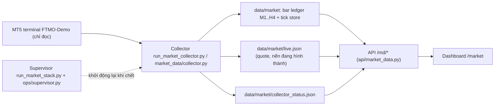
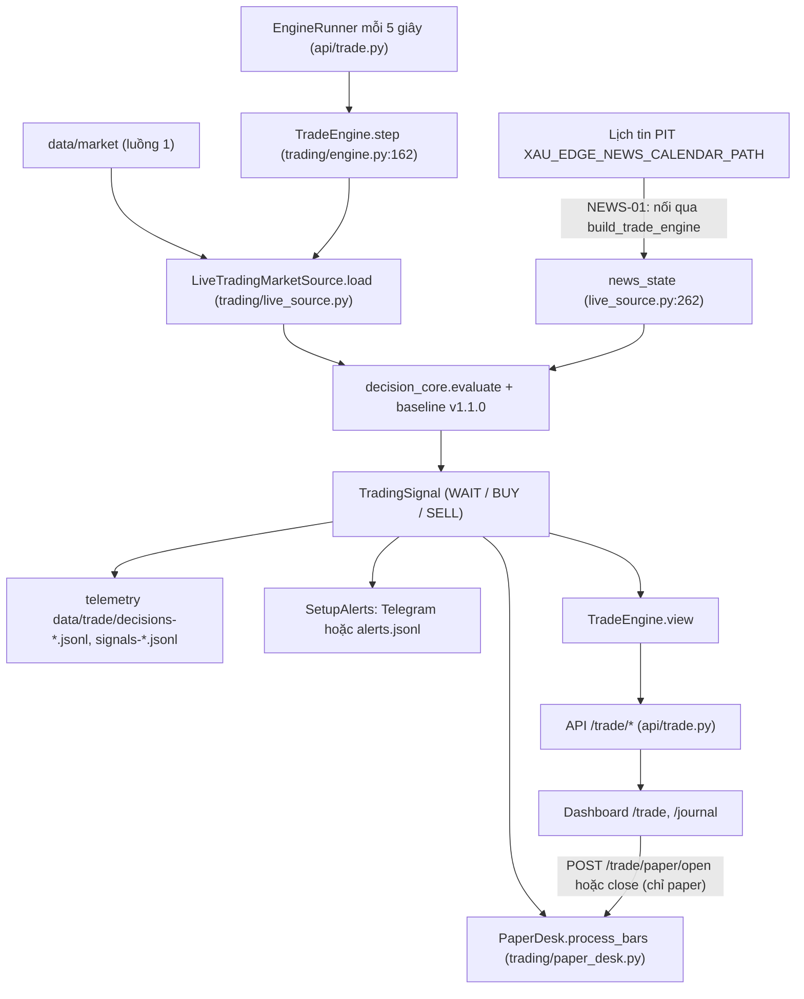
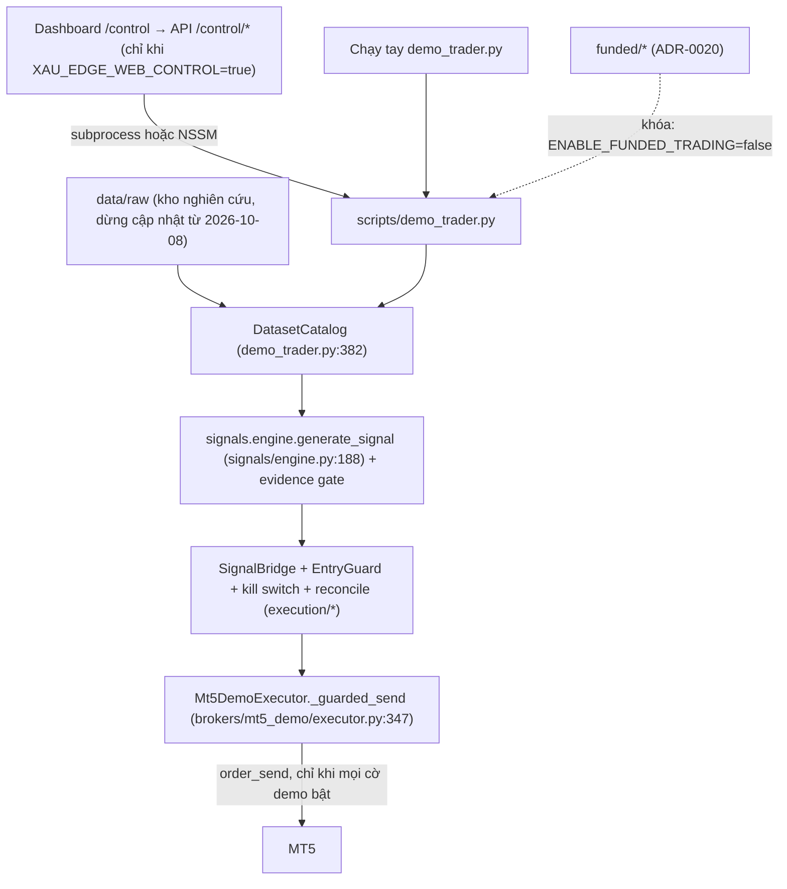

# Luồng end-to-end: từ dữ liệu MT5 đến quyết định và lệnh

> Kiểm chứng từ mã nguồn và quan sát trực tiếp ngày 2026-10-10 (HEAD `e7aeddb` + sửa NEWS-01).
> Mọi mắt xích có file:dòng. Thay thế bản ngày 2026-10-08 (bản đó mô tả một engine duy nhất trên
> `data/raw`, đã lỗi thời).

Hệ thống hiện có **ba luồng tách rời**. Chỉ luồng 1 và 2 đang chạy liên tục; luồng 3 (đường duy nhất
có thể gửi lệnh MT5) không chạy và không nhận quyết định từ luồng 2.

## Luồng 1: dữ liệu thị trường (đang chạy)

## Luồng 2: Trading Core → paper desk → giao diện (đang chạy, chỉ PAPER)

## Luồng 3: bot demo legacy, control plane, funded (không chạy)

## Bảng trạng thái từng mắt xích

| Mắt xích | Trạng thái 2026-10-10 | Bằng chứng |
|---|---|---|
| MT5 → collector → `data/market` | Chạy, `health=GOOD`, 0 nến thiếu | `/md/status` lúc 11:13 UTC; `scripts/run_market_stack.py:38` |
| Supervisor | Chạy collector + API + tiến trình `news` (làm mới lịch tin) + dashboard; tự khởi động lại child chết | `scripts/run_market_stack.py` |
| `data/market` → TradeEngine | Chạy mỗi 5 giây | `api/trade.py:41` (`STEP_SECONDS`), `api/trade.py:120-141` |
| Lịch tin → TradeEngine | **Hoạt động (NEWS-01, quan sát LIVE 2026-10-10)**: nguồn Forex Factory weekly, `data/news/calendar.csv` 24 sự kiện USD/All, tiến trình `news` trong supervisor làm mới; trạng thái `CLEAR/BLOCKED/UNKNOWN/NOT_CONFIGURED/STALE/ERROR` trên dải TIN của /trade và thẻ Hệ thống. Chưa quan sát LIVE trạng thái BLOCKED (chỉ unit + mock); nguồn chỉ phủ tuần hiện tại | `news/status.py`, `news/forexfactory.py`, `scripts/news_update.py`, `docs/reports/NEWS_SOURCE_DECISION.md` |
| Quyết định | 249/249 là WAIT (09/10 12:53 UTC → 10/10); top lý do NO_SETUP 151, TIMEFRAME_CONFLICT 35, NO_TRIGGER 35 | `data/trade/decisions-*.jsonl`; 0 file `signals-*.jsonl` |
| Telemetry | Độ phủ đo được (TELEMETRY-01): 48,6% (232/477) cho 09-10/10; hai khoảng thiếu 30 và 215 phút = tiến trình engine không chạy khi restart (engine không ghi bù). Forward acceptance nói "FORWARD EVIDENCE INCOMPLETE" dưới 95% | `trading/coverage.py`, `/trade/decision` `decision_coverage` |
| PaperDesk | READY, 0 lệnh | tab Hệ thống trên `/trade` |
| Forward acceptance | F0 (chưa thấy setup LIVE nào) | `trading/cockpit.py:forward_acceptance`, ảnh `docs/reports/img/audit-2026-10-10/05-trade-tab-system.png` |
| `data/raw` | Đứng yên từ 2026-10-08 13:15 UTC | trang `/legacy` (ảnh `10-legacy.png`) |
| `demo_trader.py` | Không chạy (heartbeat stale 2760 phút) | `/bot/status` qua `/legacy` |
| TradeEngine → executor | **Không có liên kết.** Engine chỉ chạm PaperDesk | `trading/engine.py:1-11` (docstring), `scripts/demo_trader.py:102` dùng `signals.engine` |
| `/control/*` | Không mount (503): trang hiện "CONTROL DISABLED", không poll (CONSIST-01) | `scripts/serve_api.py:67-75`, `config.py:69`, `components/ControlPanel.tsx` |
| Funded | Khóa | `config.py:51`, ADR-0020 |
| Khóa demo | LOCKED: thiếu `MT5_TRADE_PASSWORD`, demo flag false, dry-run true, whitelist trống | `trading/demo_lock.py`, tab Hệ thống |

## Các điểm đứt hoặc lệch quan trọng

1. **Hai engine quyết định, hai kho dữ liệu.** Trading Core (`trading/*`, `data/market`) là thứ giao diện
   hiển thị; executor MT5 chỉ nhận tín hiệu từ `signals.engine` trên `data/raw` đã cũ. Một quyết định
   BUY/SELL trên `/trade` không bao giờ thành lệnh demo. Kế hoạch gộp: `docs/trading/LEGACY_DEMO_BOT_MIGRATION.md` (chưa làm).
2. **UNKNOWN được coi là thị trường mở** trong Trading Core (`trading/live_source.py:90-91`), và tin tức UNKNOWN
   chỉ là cảnh báo (`api/trade.py` `allow_unknown_news=True`). Chấp nhận được cho PAPER, không được mang
   nguyên sang đường gửi lệnh.
3. ~~`data_age_seconds` đóng băng khi thị trường đóng~~ — đã xử lý (CONSIST-01): máy chủ đo lại bốn loại tuổi mỗi lần serve
   (`trading/data_health.py`); thị trường đóng là `MARKET_CLOSED`, không phải `STALE`.
