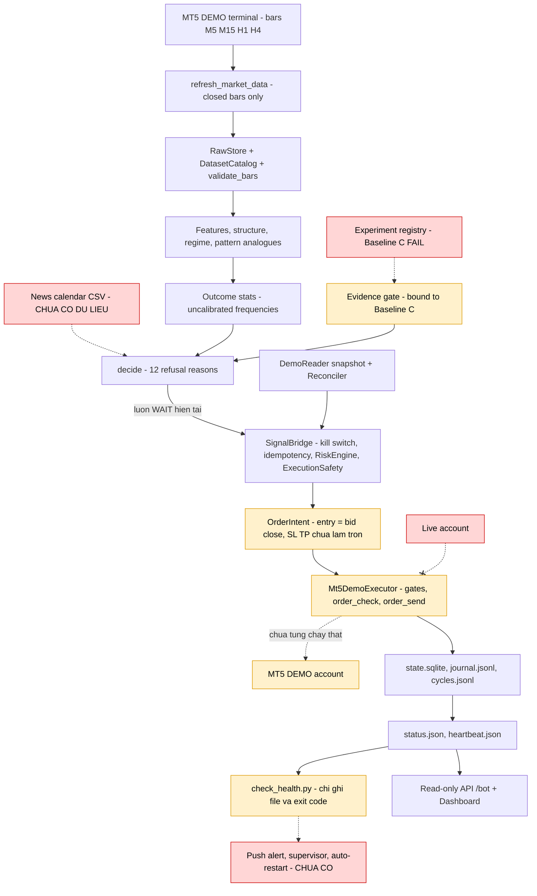

# Luồng chạy từ dữ liệu đến lệnh (end-to-end)

> Trạng thái tại 2026-10-08. Nút đỏ là chỗ chuỗi bị đứt. Nút cam là phần mới làm một nửa, hoặc mới chỉ test bằng fake/mock.

## Trạng thái từng mắt xích

| Mắt xích | Trạng thái | Bằng chứng |
|---|---|---|
| Dữ liệu tới tín hiệu | Chạy trên dữ liệu thật | `data/execution/cycles.jsonl` có 8 dòng, `data_age` từ 0,33 đến 8 phút |
| Tín hiệu tới bridge | Bị chặn: mọi chu kỳ đều `WAIT` | Lý do trong journal: `NO_VALIDATED_EDGE`, `NEWS_UNKNOWN` |
| Tin tức | Đứt: không có dữ liệu | `.env` không có `XAU_EDGE_NEWS_CALENDAR_PATH`; `news/calendar.py:1-6` |
| Executor tới MT5 | Chỉ test với fake | `docs/reports/demo-bot-status.md:25-29`; `.env` không có `MT5_TRADE_PASSWORD` |
| Live | Chặn có chủ đích | `config.py:49-58`; `brokers/mt5_demo/reader.py:89-91` |
| Giám sát | Chỉ ghi file | `scripts/check_health.py:44-49` |

## Các lỗi nằm trên luồng

- **Evidence gate** bị gắn cứng vào Baseline C, chiến lược đã trượt tiêu chí (`signals/engine.py:53-57`).
- **OrderIntent** lấy giá vào lệnh là giá close M15 (bid), trong khi executor so với ask và chỉ cho lệch 30 point, nhỏ hơn spread trung vị 31 point. Vì vậy lệnh BUY gần như luôn bị từ chối (`executor.py:288-293`).
- **SL/TP** không được làm tròn theo `digits` (`decision.py:166-167`).
- **Vòng lặp** không bắt `RuntimeError` khi mất kết nối MT5, nên tiến trình thoát hẳn (`scripts/demo_trader.py`).
